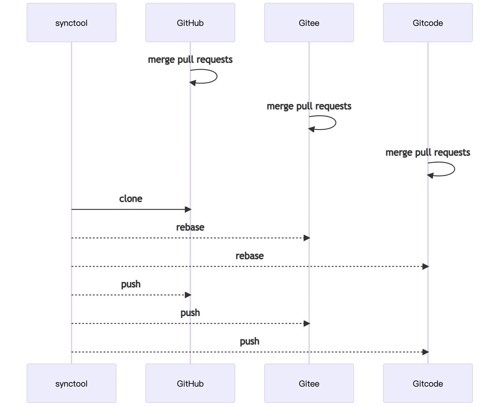
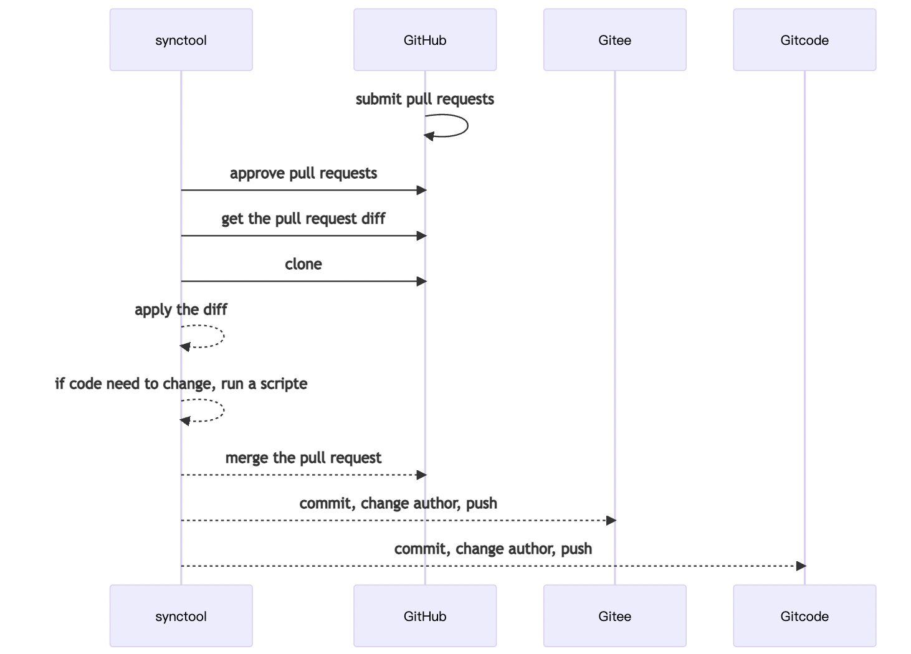
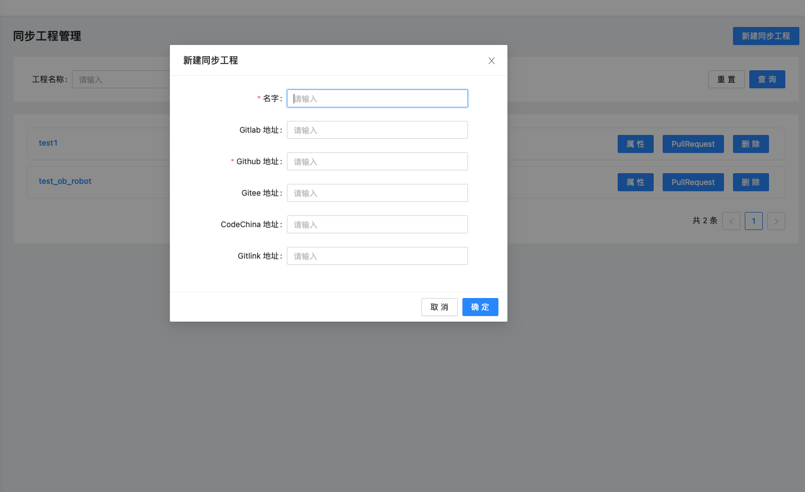

# ob-repository-synchronize

## 描述

ob-repository-synchronize是一个帮助工程师进行多平台代码同步的小工具，平台包括GitHub，Gitee，CodeChina，Gitlink和内部仓库平台等等，平台部分功能待完善。

## 原理

### 基于git rebase的多方向同步方案

### 基于git diff的单方向同步方案

## 后端

### 依赖

name|version|necessity
--|:--:|--:
python|3.9|True
uvicorn|0.14.0|True
SQLAlchemy|1.4.21|True
fastapi|0.66.0|True
aiohttp|3.7.4|True
pydantic|1.8.2|True
starlette|0.14.2|True
aiomysql|0.0.21|True
requests|2.25.1|True
loguru|0.6.0|True
typing-extensions|4.1.1|True
aiofiles|0.8.0|True

### 如何安装

> [!NOTE]
> 运行代码必须在python 3.9环境下面

`pip3 install -r requirement.txt`

`python3 main.py`

### 在本地跑同步脚本

`python3 sync.py`

## 前端

[参考web下的readme](web/README.md)

## docker

`docker pull XXX:latest`

`docker run -p 8000:8000 -d XXX bash start.sh -s backend`

## 如何使用

1. 部署数据库

- 创建一个自己的database，跑在sql文件夹下的table.sql文件
- 设置自己的数据库连接串在src/base/config.py文件内

2. 通过网页设置自己仓库地址，同步分支和平台token（待完善）

3. 自适应配置自己的同步脚本，请参考example下的两个例子，然后运行自己的脚本在一个定时任务下面

应该考虑的一些内容:

- 仓库使用http链接还是ssh链接(如何把你自己的ssh key送入进来)
- 选择rebase还是diff逻辑
- 选择什么定时任务(或许是k8s cronjob或者是linux操作系统的crontab)
